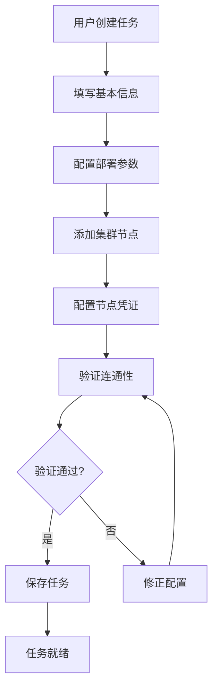
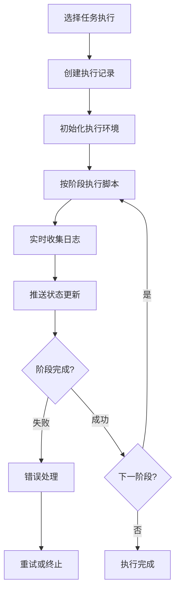

# K8S集群一键部署系统 - 系统设计文档

## 一、系统架构概述

### 1.1 系统定位
本系统是一个基于Web的Kubernetes集群自动化部署平台，通过可视化界面实现集群部署任务的创建、配置、执行和监控。

### 1.2 技术架构
- **前端**: Vue 3 + TypeScript + Element Plus + WebSocket
- **后端**: Node.js + Express + Socket.IO
- **数据存储**: JSON文件系统 (可扩展为MySQL/PostgreSQL)
- **执行引擎**: Shell脚本编排 + 任务队列
- **实时通信**: WebSocket/SSE

### 1.3 系统分层
```
┌─────────────────────────────────────────┐
│              前端UI层                     │
│    (任务管理/模板配置/执行监控)           │
├─────────────────────────────────────────┤
│              API网关层                    │
│    (RESTful API / WebSocket)            │
├─────────────────────────────────────────┤
│              业务逻辑层                   │
│    (任务管理/模板引擎/执行调度)           │
├─────────────────────────────────────────┤
│              数据访问层                   │
│    (文件系统/数据库)                     │
├─────────────────────────────────────────┤
│              执行引擎层                   │
│    (Shell脚本编排/任务队列)              │
└─────────────────────────────────────────┘
```

## 二、核心实体设计

### 2.1 实体关系图 (ERD)
```
User (用户)
    │
    │ 1:N
    ▼
Task (部署任务)
    │
    │ 1:N
    ▼
Node (集群节点)
    │
    │ 1:N
    ▼
NodeCredential (节点凭证)

Task (部署任务)
    │
    │ 1:N
    ▼
Execution (执行记录)
    │
    │ 1:N
    ▼
ExecutionLog (执行日志)
    │
    │ 1:N
    ▼
StageLog (阶段日志)

Task (部署任务)
    │
    │ N:M
    ▼
Template (部署模板)

Task (部署任务)
    │
    │ 1:N
    ▼
TaskComponent (组件配置)
```

### 2.2 详细实体设计

#### 2.2.1 用户实体 (User)
```json
{
  "id": "string",           // UUID
  "username": "string",     // 用户名
  "password": "string",     // 加密后的密码
  "role": "string",         // 角色: admin/operator/viewer
  "email": "string",        // 邮箱
  "createdAt": "datetime",  // 创建时间
  "updatedAt": "datetime",  // 更新时间
  "isActive": "boolean"     // 是否激活
}
```

#### 2.2.2 部署任务实体 (Task)
```json
{
  "id": "string",                    // UUID
  "name": "string",                  // 任务名称
  "description": "string",           // 任务描述
  "creatorId": "string",             // 创建人ID
  "status": "string",                // 状态: draft/ready/running/completed/failed/cancelled
  "config": {                        // 部署配置
    "workspace": "string",           // 工作路径，默认: /data
    "nfsServerIp": "string",         // NFS服务器IP
    "nfsPath": "string",             // NFS路径
    "installRegistry": "boolean",    // 是否安装镜像仓库
    "registryAddress": "string",     // 镜像仓库地址
    "installElasticsearch": "boolean", // 是否安装ES+SkyWalking
    "installLoki": "boolean",        // 是否安装Loki
    "installPrometheus": "boolean",  // 是否安装Prometheus
    "installRedis": "boolean"        // 是否安装Redis哨兵模式
  },
  "metadata": {
    "createdAt": "datetime",         // 创建时间
    "updatedAt": "datetime",         // 更新时间
    "startedAt": "datetime",         // 开始执行时间
    "completedAt": "datetime",       // 完成时间
    "estimatedDuration": "number"    // 预估执行时长(分钟)
  }
}
```

#### 2.2.3 集群节点实体 (Node)
```json
{
  "id": "string",                    // UUID
  "taskId": "string",                // 所属任务ID
  "alias": "string",                 // 节点别名
  "ipv4Address": "string",           // IPv4地址
  "ipv6Address": "string",           // IPv6地址
  "isControlPlane": "boolean",       // 是否为管理平面节点
  "status": "string",                // 节点状态: pending/ready/connected/error
  "credentialId": "string",          // 凭证ID
  "connectivity": {
    "sshAccessible": "boolean",      // SSH连通性
    "lastCheckAt": "datetime",       // 最后检查时间
    "responseTime": "number"         // 响应时间(ms)
  },
  "metadata": {
    "createdAt": "datetime",
    "updatedAt": "datetime"
  }
}
```

#### 2.2.4 节点凭证实体 (NodeCredential)
```json
{
  "id": "string",                    // UUID
  "name": "string",                  // 凭证名称
  "type": "string",                  // 认证类型: password/key
  "username": "string",              // SSH用户名
  "password": "string",              // 加密后的密码
  "privateKey": "string",            // 加密后的私钥
  "passphrase": "string",            // 私钥密码(可选)
  "port": "number",                  // SSH端口，默认: 22
  "creatorId": "string",             // 创建人ID
  "isDefault": "boolean",            // 是否为默认凭证
  "metadata": {
    "createdAt": "datetime",
    "updatedAt": "datetime"
  }
}
```

#### 2.2.5 执行记录实体 (Execution)
```json
{
  "id": "string",                    // UUID
  "taskId": "string",                // 任务ID
  "status": "string",                // 执行状态: pending/running/completed/failed/cancelled
  "currentStage": "number",          // 当前阶段(1-19)
  "totalStages": "number",           // 总阶段数(19)
  "progress": "number",              // 执行进度(0-100)
  "startTime": "datetime",           // 开始时间
  "endTime": "datetime",             // 结束时间
  "duration": "number",              // 执行时长(秒)
  "error": {                         // 错误信息
    "stage": "number",               // 出错阶段
    "message": "string",             // 错误消息
    "stack": "string"                // 错误堆栈
  },
  "metadata": {
    "executorId": "string",          // 执行人ID
    "triggerType": "string",         // 触发类型: manual/schedule/retry
    "retryCount": "number"           // 重试次数
  }
}
```

#### 2.2.6 部署模板实体 (Template)
```json
{
  "id": "string",                    // UUID
  "name": "string",                  // 模板名称
  "description": "string",           // 模板描述
  "category": "string",              // 模板分类: networking/storage/monitoring
  "content": "string",               // YAML模板内容
  "variables": [                     // 模板变量
    {
      "name": "string",              // 变量名
      "type": "string",              // 变量类型: string/number/boolean
      "defaultValue": "string",      // 默认值
      "description": "string",       // 描述
      "required": "boolean"          // 是否必填
    }
  ],
  "creatorId": "string",             // 创建人ID
  "version": "string",               // 版本号
  "isActive": "boolean",             // 是否启用
  "metadata": {
    "createdAt": "datetime",
    "updatedAt": "datetime",
    "lastUsedAt": "datetime"
  }
}
```

#### 2.2.7 执行日志实体 (ExecutionLog)
```json
{
  "id": "string",                    // UUID
  "executionId": "string",           // 执行记录ID
  "nodeId": "string",                // 节点ID
  "stage": "number",                 // 阶段编号(1-19)
  "stageName": "string",             // 阶段名称
  "level": "string",                 // 日志级别: info/warn/error
  "message": "string",               // 日志消息
  "timestamp": "datetime",           // 时间戳
  "source": "string"                 // 日志来源
}
```

## 三、业务流程设计

### 3.1 任务创建流程


### 3.2 执行监控流程


## 四、API接口设计

### 4.1 任务管理API
- `GET /api/tasks` - 获取任务列表
- `POST /api/tasks` - 创建新任务
- `GET /api/tasks/:id` - 获取任务详情
- `PUT /api/tasks/:id` - 更新任务
- `DELETE /api/tasks/:id` - 删除任务
- `POST /api/tasks/:id/execute` - 执行任务
- `POST /api/tasks/:id/cancel` - 取消执行

### 4.2 节点管理API
- `GET /api/nodes` - 获取节点列表
- `POST /api/nodes` - 添加节点
- `PUT /api/nodes/:id` - 更新节点
- `DELETE /api/nodes/:id` - 删除节点
- `POST /api/nodes/:id/test-connection` - 测试连通性

### 4.3 模板管理API
- `GET /api/templates` - 获取模板列表
- `POST /api/templates` - 创建模板
- `GET /api/templates/:id` - 获取模板内容
- `PUT /api/templates/:id` - 更新模板
- `DELETE /api/templates/:id` - 删除模板
- `POST /api/templates/:id/refresh` - 刷新模板变量

### 4.4 执行监控API
- `GET /api/executions` - 获取执行记录
- `GET /api/executions/:id` - 获取执行详情
- `GET /api/executions/:id/logs` - 获取执行日志
- `POST /api/executions/:id/retry` - 重试执行
- `WebSocket /ws/executions/:id` - 实时日志推送

## 五、数据存储设计

### 5.1 文件结构
```
data/
├── users/                    # 用户数据
│   └── {userId}.json
├── tasks/                    # 任务数据
│   └── {taskId}.json
├── nodes/                    # 节点数据
│   └── {nodeId}.json
├── credentials/              # 凭证数据
│   └── {credentialId}.json
├── templates/                # 模板数据
│   └── {templateId}.json
├── executions/               # 执行记录
│   └── {executionId}.json
├── logs/                     # 日志文件
│   └── {executionId}/
│       ├── stage_1.log
│       ├── stage_2.log
│       └── ...
└── config/                   # 系统配置
    ├── app.json
    └── security.json
```

### 5.2 数据索引文件
```
data/
├── indexes/
│   ├── tasks_by_user.json    # 用户任务索引
│   ├── nodes_by_task.json    # 任务节点索引
│   ├── executions_by_task.json # 任务执行记录索引
│   └── templates_by_category.json # 模板分类索引
```

## 六、安全设计

### 6.1 认证与授权
- JWT Token认证
- 基于角色的访问控制(RBAC)
- API访问频率限制

### 6.2 数据安全
- 节点凭证AES-256加密存储
- 敏感配置信息加密
- 操作日志审计

### 6.3 执行安全
- 脚本执行环境隔离
- SSH连接安全验证
- 错误日志脱敏处理

## 七、部署架构

### 7.1 单机部署
```
┌─────────────────────────────────┐
│         应用服务器                │
│  ┌─────────────────────────────┐ │
│  │     Node.js 应用            │ │
│  │  + Express                  │ │
│  │  + Socket.IO               │ │
│  │  + 文件存储                 │ │
│  └─────────────────────────────┘ │
└─────────────────────────────────┘
```

### 7.2 Docker容器化部署
```yaml
version: '3.8'
services:
  k8s-installer:
    build: .
    ports:
      - "3000:3000"
    volumes:
      - ./data:/app/data
      - ./scripts:/app/scripts
    environment:
      - NODE_ENV=production
      - JWT_SECRET=${JWT_SECRET}
      - ENCRYPTION_KEY=${ENCRYPTION_KEY}
```

## 八、扩展规划

### 8.1 短期扩展(v1.1)
- 用户权限管理完善
- 模板版本控制
- 批量操作功能
- 性能监控面板

### 8.2 中期扩展(v2.0)
- 多集群管理
- 高可用部署
- 数据库持久化
- API网关集成

### 8.3 长期扩展(v3.0)
- AI智能诊断
- 自动化运维
- 企业级集成
- 云原生支持